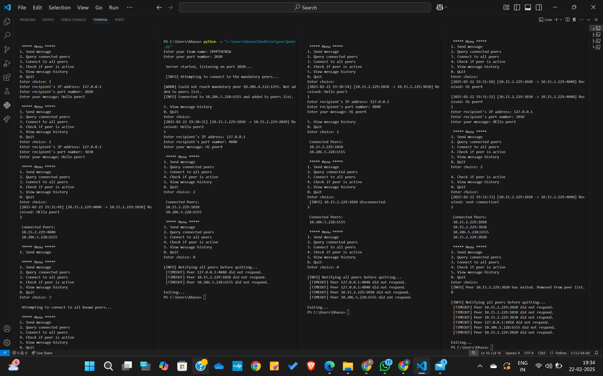

# CryptoCrew

## Team
Team-name: CryptoCrew
Annamareddi Suhitha - cse230001008,
Polathala Bhavana - mc230041026,
Vangapally PranavaReddy - mc230041037.

## Description
This is a Peer-to-Peer Chat Application implemented in Python using sockets and threading. The program allows peers to connect, exchange messages, and track their communication history.

## Features
1.Mandatory Peer Connection – The peer tries to connect to predefined mandatory peers at startup.
2.Interactive Menu – Provides a user-friendly menu for sending messages, checking peers, and viewing history.
3.Message Exchange – Sends and receives messages between peers, storing message history.
4.Peer Discovery & Tracking – Tracks peers it communicates with and maintains a list of sent peers separately.
5.Exit Notification – Notifies all connected and messaged peers when a peer quits.

## Interpretations
It’s a simple chat system where computers can send messages to each other, allowing direct communication between devices (peers) without relying on a central server. Since there is no central authority, messages remain private between peers, making the system more decentralized. This setup demonstrates basic peer-to-peer communication, which is useful for distributed systems and networking applications.

## How to run?
1. Run the python file.
2. Input the team-name, followed by port number.
3. To send a message to the recipient using their IP address and port, enter '1'.
4. Choose '2' to see a list of all connected peers.
5. To reconnect with all previously communicated peers, enter '3'.
6. Choose '4' to check if a specific peer is active.
7. To display chat-history input '5'.
8. Enter '0' to quit the program.

## Bonus Implementation
1.Implemented a functionality to reconnect with all previously communicated peers.
2.A feature to display the entire chat history has been included.

## Sample output Screenshot

